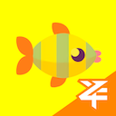

     
    

<h1 align="center">
一起吃小鱼
</h1>

一个基于浏览器控制台（Devtool）的6k下落式小游戏

## 导入方法
- 在你的项目中导入仓库里的“main.js”即可～

## 游玩方式
- 在浏览器控制台中输入"eat_fish_together()"即可开始游戏！

## 游戏模式

#### 1. 无尽模式
往控制台输入"eat_fish_together()"即可进入无尽模式。

在此模式中，可以使用S、D、F、J、K、L默认六个键位（未来会更新自定义键位）吃掉最下面一排的小鱼，没有时间上的限制，可供简单游玩。

#### 2. 20秒模式
往控制台输入"eat_fish_together(1)"即可进入20秒模式。

在此模式中，比无尽模式新增倒计时和按错惩罚，20秒倒计时一过或者按错次数超过十次游戏结束，可以作为在无尽模式练习结束后的挑战。

## 部分预览

